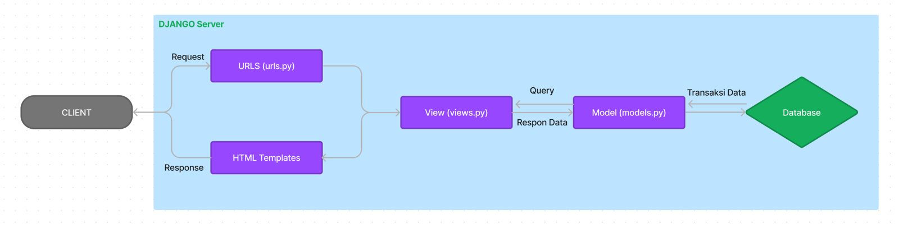
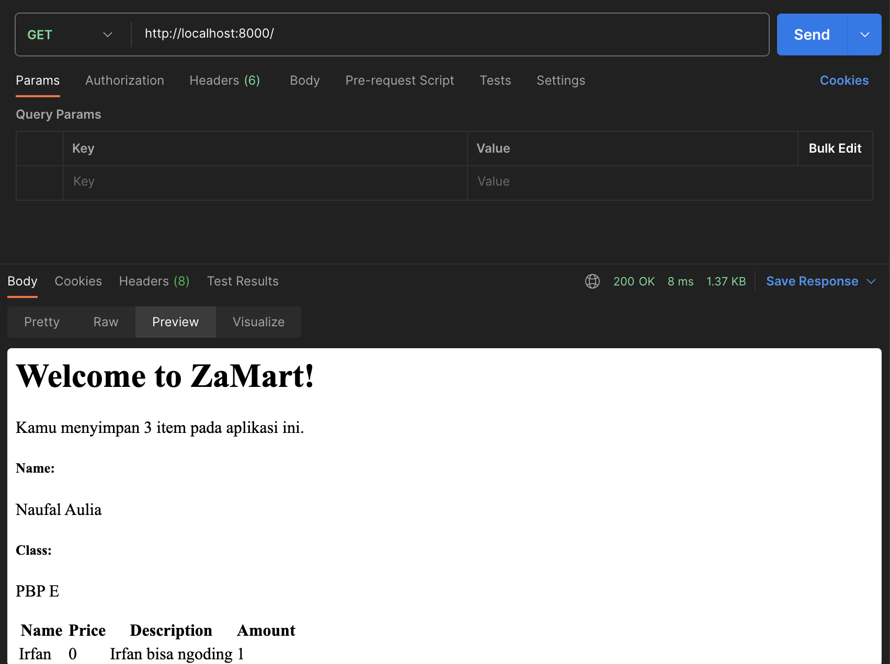
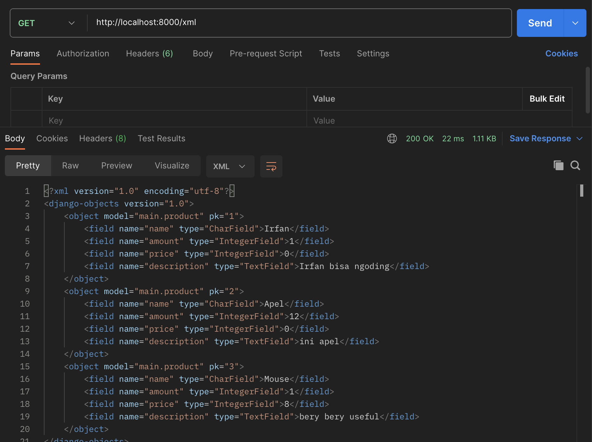
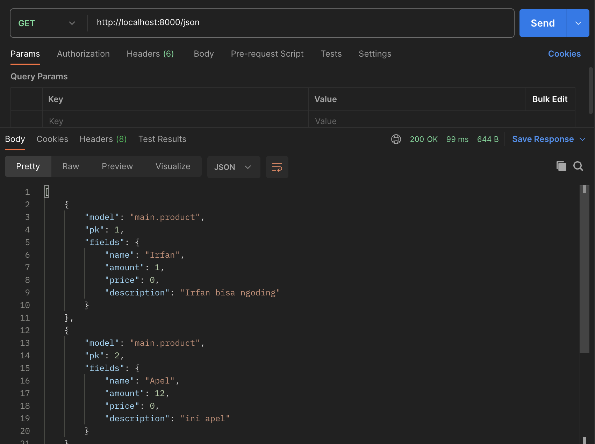
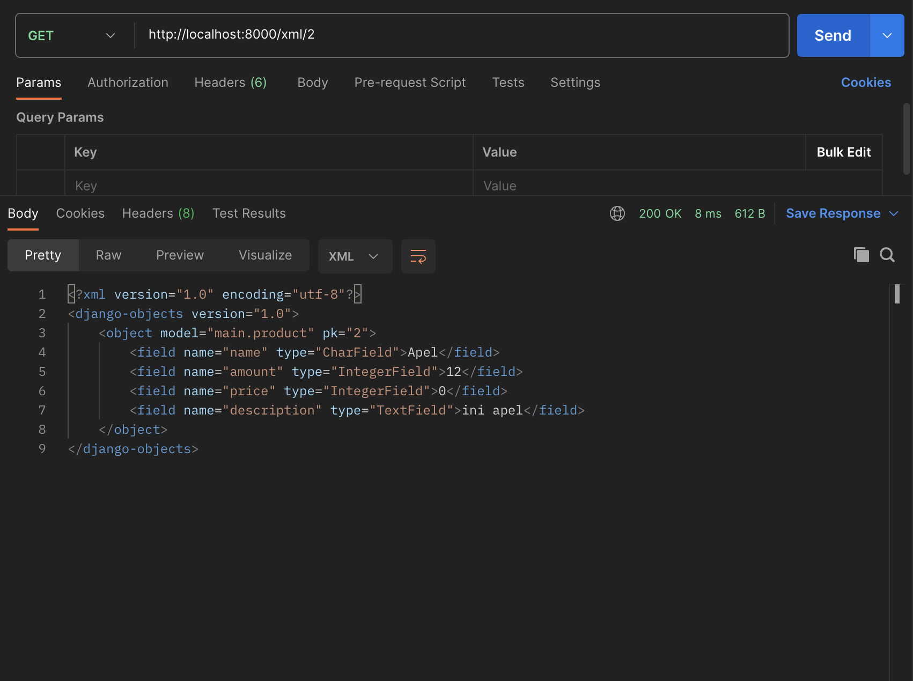
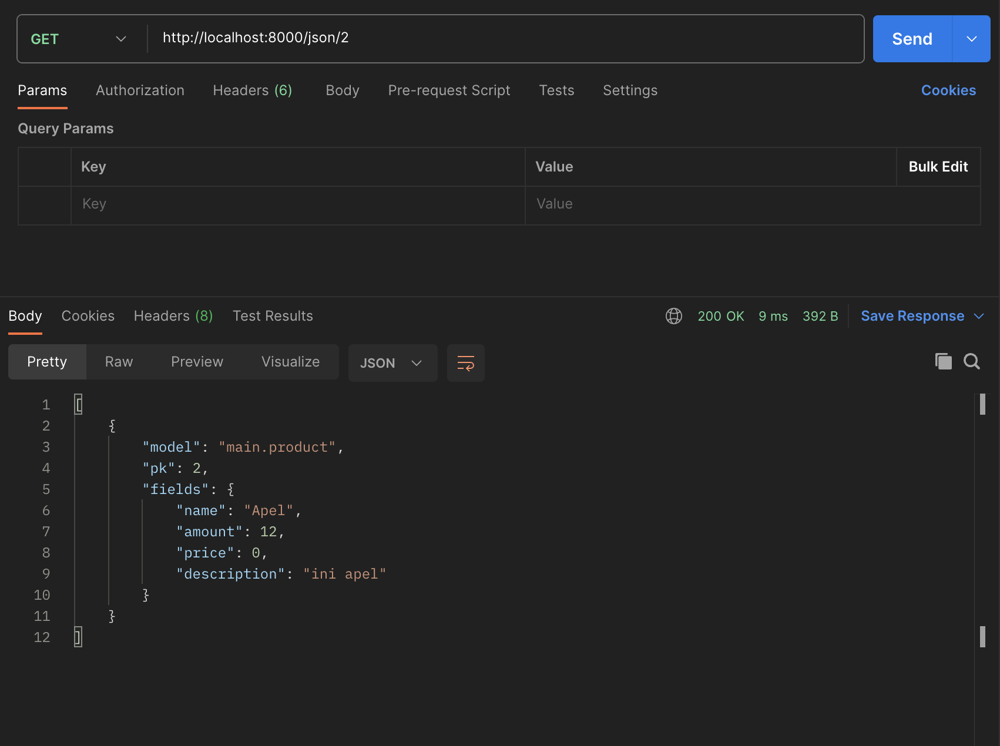

# ZAMART
[Link Adaptable]( https://zamart.adaptable.app/main)

Naufal Aulia - 2206082455 - PBP E

# Tugas 2
## Implementasi _checklist_ dari awal sampai akhir
1. __Membuat sebuah proyek Django baru__
    1. Membuat direktori baru bernama ZaMart
    2. Membuat _virtual environment_ baru dengan menjalankan perintah berikut di dalam _terminal shell_ direktori
        * Mac
        ```bash
        python3 -m venv env
        ```
    3. Setelah itu, aktifkan _virtual environment_ dengan menjalankan kode berikut.
        * Mac
        ```bash
        source env/bin/activate
        ```
    4. Membuat berkas `requirements.txt` di dalam direktori yang sama dan tambahkan beberapa _dependencies_ yang diperlukan dalam proyek ini.
    5. Memasang _dependencies_ dengan menjalankan perintah berikut dan pastikan _virtual environment_ sedang berjalan.
        ```bash
        pip install -r requirements.txt
        ```
    6. Membuat proyek Django bernama ZaMart dengan perintah berikut.
        ```bash
        django-admin startproject ZaMart .
        ```
    7. Tambahkan `*` pada `ALLOWED_HOST` di `setings.py` untuk mengizinkan akses dari semua host, yang akan memungkinkan aplikasi diakses secara luas. 
        ```python
        ...
        ALLOWED_HOSTS = ["*"]
        ...
    8. Membuat file `.gitignore` di dalam direktori yang sama untuk menentukan berkas-berkas dan direktori-direktori yang harus diabaikan oleh Git.
2. __Membuat aplikasi dengan nama main pada proyek ZaMart.__
    1. Jalankan perintah berikut untuk membuat aplikasi baru, pastikan _virtual environment_ sudah aktif. 
        ```bash
        python manage.py startapp main
        ```
    2. Daftarkan `main` ke dalam proyek dengan membuka berkas `settings.py` di dalam proyek `ZaMart` dan cari variabel `INSTALLED_APPS`. Tambahkan 'main' ke dalam daftar aplikasi yang sudah ada.
3. __Melakukan _routing_ pada proyek agar dapat menjalankan aplikasi `main`.__
    1. Buka berkas `urls.py` di dalam direktori `ZaMart` dan import fungsi `include` dari `django.urls`
        ```python
        ...
        from django.urls import path, include
        ...
        ```
    2. Tambahkan rute URL seperti berikut untuk mengarahkan ke tampilan `main` dalam `urlpatterns`
        ```python
        urlpatterns = [
        ...
        path('main/', include('main.urls')),
        ...
        ]
        ```
4. __Membuat model pada aplikasi `main` dengan nama `Item` dan memiliki atribut wajib.__
    1. Buka berkas `models.py` pada direktori `main` dan isi berkas tersebut dengan kode berikut.
        ```python
        from django.db import models

        class Product(models.Model):
            name = models.CharField(max_length=255)
            amount = models.IntegerField()
            description = models.TextField()
        ```
    2. Lakukan migrasi model dengan menjalankan perintah berikut.
        ```bash
        python3 manage.py makemigrations
        ```
        Lalu jalankan kode selanjutnya.
        ```bash
        python3 manage.py migrate
        ```
5. __Membuat sebuah fungsi pada views.py untuk dikembalikan ke dalam sebuah template HTML.__
    1. Buat direktori baru di dalam direktori `main` bernama `templates`.
    2. Buat berkas baru bernama `main.html` di dalam direktori `templates` dan isi dengan kode berikut.
        ```html
        <h1>Welcome To ZaMart</h1>

        <h5>Name: </h5>
        <p>{{ name }}</p>
        <h5>Class: </h5>
        <p>{{ class }}</p>
        ```
    3. Buka berkas `views.py` yang terletak pada berkas `main`. Tambahkan baris-baris impor berikut di bagian paling atas berkas dan tambahkan fungis `show_main`.
        ```python
        def show_main(request):
            context = {
                'name': 'Naufal Aulia',
                'class': 'PBP E'
            }
            return render(request, "main.html", context)
        ```
6. __Membuat sebuah routing pada urls.py aplikasi main untuk memetakan fungsi  `views.py`.__
    1. Buat berkas `urls.py` di dalam direktori `main`.
    2. Isi `urls.py` dengan kode berikut.
        ```python
        from django.urls import path
        from main.views import show_main

        app_name = 'main'

        urlpatterns = [
            path('', show_main, name='show_main'),
        ]
        ```
7. __Melakukan _depoloyment_ ke Adaptable__
    1. Membuat repositori baru di _github_ yang bernama ZaMart dan lakukan perintah `add`, `commit`, `branch`, `remote`, dan `push`.
    2. _Login_ pada website Adaptable.io dengan menggunakan akun github yang berisi repositori yang ingin di-_deploy_.
    3. Hubungkan Adaptable.io dengan GitHub dan pilih `All Repositories`pada proses instalasi.
    4. Pilih repositori `ZaMart` sebagai basis aplikasi yang akan di-_deploy_.
    5. Pilihlah `Python App Template` sebagai template deployment.
    6. Pilih `PostgreSQL` sebagai tipe basis data yang akan digunakan.
    7. Pilih versi python yang sesuai, dimana versi python yang digunakan saat ini adalah 3.10
    8. Pada bagian `Start Command` masukkan perintah `python manage.py migrate && gunicorn ZaMart.wsgi`.
    9. Masukkan `ZaMart` sebagai nama aplikasi yang juga akan menjadi nama domain situs web 
    10. Centang bagian `HTTP Listener on PORT` dan klik `Deploy App` untuk memulai proses _deployment_ aplikasi.

## Bagan _Request client_ ke web berbasis Django
 
- Client akan melakukan request ke aplikasi (server Django).
- Setelah itu, server akan memilih View sesuai request yang diberikan oleh client.
- Jika request tersebut perlu mengakses database, maka server akan memilih model serta mengakses database langsung.
- Hasil _response_ dari model akan ditampilkan sesuai template html yang sesuai.
- Template HTML akan menampilkan hasil dari _request_ yang diminta _client_ sebelumnya.

## Kenapa ***Virtual Environment?***
- _Virtual environment_ adalah lingkungan kerja yang terisolasi untuk mengembangkan sebuah perangkat lunak. _Virtual environment_ memungkinkan untuk mengisolasi paket-paket python yang digunakan dalam satu proyek dari paket-paket yang dipakai oleh proyek-proyek lainnya. Terdapat beberapa manfaat yang didapatkan saat menggunakan _virtual environment_ antara lain adalah:
    - Isolasi
    - Manajemen Idependensi
    - Kebersihan
    - Isolasi versi python
    - Portabilitas
- Proyek Django masih dapat dijalankan tanpa menggunakan _virtual environment_, akan tetapi terdapat hal-hal yang harus diperhatikan seperti konflik depensi dengan paket global, penggunaan versi python, dan masih banyak hal lagi. 
- Penggunaan _virtual environment_ dalam menjalankan proyek Django sangat disarankan karena _virtual environment_ membantu menjaga proyek Django bersih, terisolasi, dan lebih mudah dikelola.
## Apa itu ***MVC, MVT, dan MVVM***
- MVC (Model View Controller)
    - Model : Berinteraksi dengan database dan logika bisnis aplikasi
    - View : Menampilkan data kepada pengguna
    - Controller : Berfungsi untuk mengatur alur aplikasi dan sebagai perantara antara Model dan View
- MVT (Model View Template)
    - Model : Berinteraksi dengan database dan logika bisnis aplikasi
    - View : Menampilkan data kepada _user_, namun juga berisi logika untuk menampilkan data kepada pengguna
    - Template : Berfungsi untuk memproses tampilan yang berisi kode HTML yang digunakan untuk menampilkan data
- MVVM (Model View ViewModel)
    - Model : Bertanggung jawab atas abstraksi sumber data
    - View : Berfungsi untuk menginformasikan ViewModel tentang tindakan pengguna. View juga  mengamati ViewModel dan tidak mengandung logika aplikasi apa pun.
    - ViewModel : Bergfungsi untuk mengekspos aliran data yang relevan dengan View. Selain itu, itu server sebagai penghubung antara Model dan View.
- Perbedaan utama antara ketiga model:
    - MVC : Terdapat controller sebagai pengelola alur utama aplikasi dan perantara antara view dan model
    - MVT : Terdapat template sebagai komponen untuk menampilkan tampilan dan view memiliki logika lebih untuk penampilan data
    - MVMM : Terdapat ViewModel sebagai perantara yang mengubah data dari model ke format yang lebih sesuai untuk tampilan


# Tugas 3
## Perbedaan __POST__ dan __GET__ dalam Django
- Perbedan utama antara form POST dan GET dalam Django terletak pada metode yang digunakan untuk mengirim data dari form ke server dan bagaimana data tersebut diproses,
- Form POST
    - Metode POST lebih __aman__ untuk mengirim data sensitif karena data yang dikirim tidak akan terlihat dalam `URL`.
    - Data formulir dikirim dalam tubuh permintaan HTTP, sehingga tidak terlihat oleh pengguna atau dalam URL.
    - Form POST digunakan ketika ingin mengirim data yang sensitif atau data yang akan memengaruhi perubahan di server, seperti menambahkan data baru ke database.
    
- Form GET
    - Metode GET __kurang aman__ untuk data sensitif karena data yang dikirimkan terlihat dalam URL dan dapat dengan mudah diakses oleh pengguna atau oleh seseorang yang melihat log server.
    - Data formulir dikirim sebagai parameter query string yang terlihat dalam `URL`.
    - Form GET digunakan ketika ingin melakukan pencarian atau mengambil data dari server tanpa memengaruhi data di server.

- Sumber
    - https://www.baeldung.com/cs/http-get-vs-post
    - https://www.w3schools.com/tags/ref_httpmethods.asp

## Perbedaan utama antara __XML__, __JSON__, dan __HTML__ dalam konteks pengiriman data
PERBEDAAN | XML | JSON | HTML |
| --- | --- | --- | --- |
|Tujuan | Menyimpan dan mentransmisikan data terstruktur | Menyimpan dan mentransmisikan data terstruktur | Merender konten web, seperti teks, gambar, tautan, dan media
|Tipe Data | Tidak memiliki tipe data bawaan, mendukung berbagai tipe data | Mendukung tipe data yang terbatas seperti string, angka, boolean, objek, larik, dan null | Mendukung tipe data khusus untuk elemen-elemen seperti teks, gambar, tautan, dan elemen media |
|Format | Bahasa Markup | Format Data (JavaScript) | Bahasa Markup|
|Basis | SGML | JavaScript | SGML |
|Encoding | Mendukung berbagai encoding | Hanya mendukung UTF-8 encoding | Mendukung berbagai encoding|

- Sumber
    - https://www.deltaxml.com/blog/xml/whats-the-relationship-between-xml-json-html-and-the-internet/
    - https://www.w3schools.com/js/js_json_xml.asp

## Mengapa __JSON__ sering digunakan dalam pertukaran data antara aplikasi web modern?

`JSON` sering digunakan dalam pertukaran data antara aplikasi web modern karena beberapa alasan, antara lain:
- __Ringkas dan mudah dipahami__, SON memiliki format yang sederhana dan mudah dipahami. Data disusun dalam bentuk pasangan "nama-nilai" yang mirip dengan struktur data dalam bahasa pemrograman, seperti objek dan array. 
- __Ringan__, JSON adalah format yang ringan dalam hal penggunaan bandwidth. Ini sangat penting dalam lingkungan web di mana penghematan bandwidth dapat meningkatkan kinerja dan efisiensi.
- __Mendukung berbagai data__, SON mendukung berbagai jenis data, termasuk teks, angka, boolean, objek, array, dan null. Ini memungkinkan representasi data yang kompleks dan bervariasi.
- __Dukungan browser__, SON dapat dengan mudah diurai (parsed) oleh browser web menggunakan JavaScript. Ini membuatnya ideal untuk komunikasi antara aplikasi web klien dan server.

- Sumber
    - https://www.sekawanmedia.co.id/blog/json-adalah/
    - https://media.neliti.com/media/publications/267827-penerapan-data-json-untuk-mendukung-peng-b1a9128a.pdf

## Implementasi _checklist_ dari awal sampai akhir
1. __Membuat input form untuk menambahkan objek model pada app sebelumnya__
    - Membuat `forms.py` pada direktori `main` untuk membuat struktur form yang dapat menerima data item baru. Menambahkan class ProductForm dengan models dari product dan fields `["name", "amount", "price", "description"]`.
2. __Menambahkan 5 fungsi `views` untuk melihat objek yang sudah ditambahkan__
    - Membuat fungsi baru bernama `create_product` yang menerima parameter request. Fungsi tersebut membuat ProductForm baru dan menyimpan dengan input user yang valid. Setelah itu redirect ke '/' (main) setelah data form berhasil disimpan.
    - Mengubah fungsi `show_main` untuk mendapatkan semua data dari Item, lalu Item tersebut ditambahkan ke context yang nantinya akan di render.
    - Menambahkan path url `create_product` pada urls.py di main yang akan menjalankan fungsi `create_product`
    - Membuat file HTML baru `create_product.html` yang isinya form sesuai fields pada forms.py untuk user mengisi inputan.
    - Menambahkan kode pada `main.html` untuk menampilkan data item dan tombol untuk redirect ke halaman form.
    - Membuat fungsi `show_xml` pada view yang isinya mengambil semua data dari Item dan mengembalikan HTTP response dalam format XML.
    - Membuat fungsi `show_json` pada view yang isinya mengambil semua data dari Item dan mengembalikan HTTP response dalam format JSON.
    - Membuat fungsi `show_xml_by_id` pada view yang isinya mengambil data dari Item yang sesuai dengan `primary key` dari url dan mengembalikan HTTP response dalam format XML.
    - Membuat fungsi `show_json_by_id` pada view yang isinya mengambil data dari Item yang sesuai dengan `primary key` dari url dan mengembalikan HTTP response dalam format JSON.

3. __Membuat routing URL untuk masing-masing views yang telah ditambahkan__
    - Mengimpor `show_main, create_product, show_xml, show_json, show_xml_by_id, show_json_by_id ` dari `main.views` untuk melakukan routing URL.
    - Membuat routing url atau path url `xml/` pada urls.py di main yang akan menjalankan fungsi `show_xml`.
    - Membuat routing url atau path url `json/` pada urls.py di main yang akan menjalankan fungsi `show_json`.
    - Membuat routing url atau path url `xml/<int:id>/` pada urls.py di main yang akan menjalankan fungsi `show_xml_by_id` dan meneruskan id ke fungsi tersebut.
    - Membuat routing url atau path url `json/<int:id>/` pada urls.py di main yang akan menjalankan fungsi `show_json_by_id` dan meneruskan id ke fungsi tersebut.

## Hasil akses fungsi views yang menampilkan objek dalam beberapa format
- __HTML__

- __XML__

- __JSON__

- __XML by id__

- __JSON by id__

